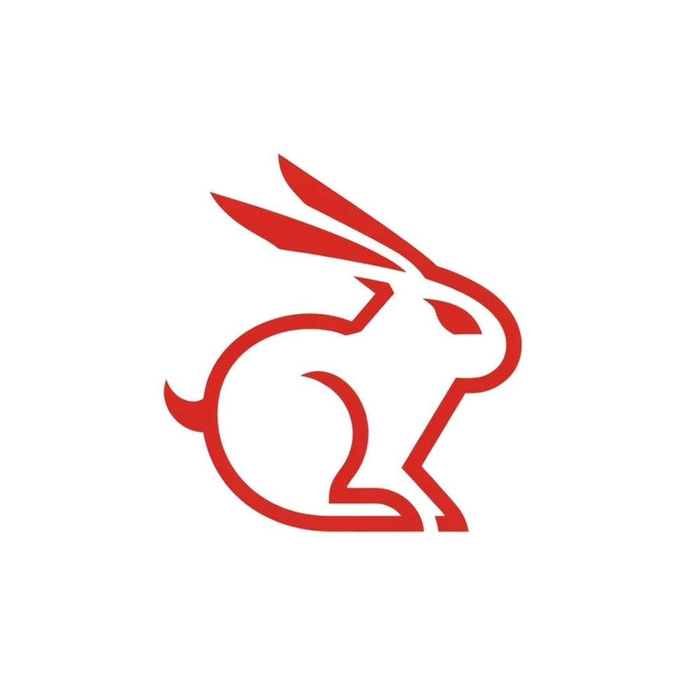
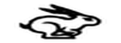
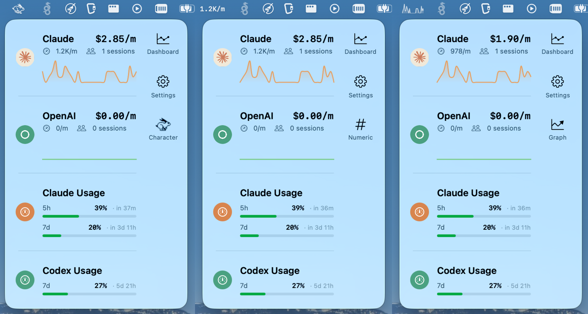
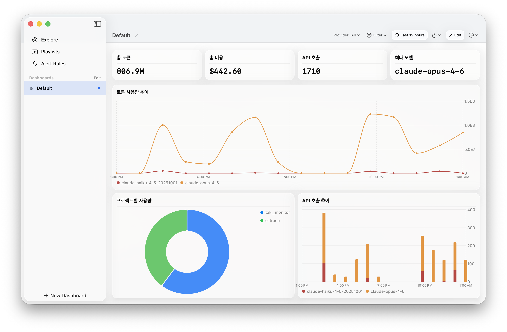

<p align="center">
  
</p>

<h1 align="center">Toki Monitor</h1>

<p align="center">
  <b>메뉴바에서 토끼가 뛰어다닙니다 — 토큰을 많이 쓸수록 빨라집니다.</b><br>
  macOS 메뉴바 AI 토큰 모니터. 프록시 없음. 클라우드 없음. 데이터는 로컬에 남습니다.
</p>

<p align="center">
  <a href="https://github.com/korjwl1/toki-monitor/releases/latest"></a>
  
  
  
  
</p>

<p align="center">
  <a href="README.md">🇺🇸 English</a> · <a href="#설치">설치</a> · <a href="#기능">기능</a> · <a href="#작동-원리">작동 원리</a> · <a href="#후원">후원</a>
</p>

<p align="center">
  
</p>

<p align="center">
  
  &nbsp;&nbsp;&nbsp;
  
</p>

> [**toki**](https://github.com/korjwl1/toki) 기반 (**to**ken **i**nspector, *tokki* = 토끼) — 빠르고 가벼운 Rust 데몬으로 AI 토큰 사용량을 추적합니다.

---

## 설치

```bash
brew tap korjwl1/tap
brew install --cask toki-monitor
```

[toki](https://github.com/korjwl1/toki)가 자동으로 함께 설치됩니다. 앱을 실행하면 데몬이 자동으로 시작됩니다. 첫 실행 시 toki의 프로바이더 설정이 자동으로 동기화됩니다.

<details>
<summary>소스에서 빌드</summary>

```bash
git clone https://github.com/korjwl1/toki-monitor.git
cd toki-monitor
xcodebuild build -scheme TokiMonitor -configuration Release
```

macOS 14+ (Sonoma), Xcode 15.2+, [toki](https://github.com/korjwl1/toki) CLI가 필요합니다.
</details>

---

## 빠른 시작

```bash
# Homebrew로 설치했다면 바로 실행:
open /Applications/TokiMonitor.app

# Claude Code / Codex를 평소처럼 사용하세요 — 토큰 사용량이 즉시 반영됩니다.
# 토끼를 클릭하면 상세 정보, 우클릭하면 설정.
```

---

## 이런 분에게 추천합니다

- **AI 비용을 한눈에 보고 싶다면?** 토큰을 쓸 때 토끼가 달리고, 몇 분간 안 쓰면 잠듭니다 (zZ). 아무것도 열 필요 없이 소비 속도가 항상 보입니다.

- **"총 토큰"보다 더 자세한 분석이 필요하다면?** 대시보드를 여세요 — 커스텀 패널, PromQL 쿼리, 시계열 차트, 프로젝트별 파이 차트. 모델, 기간, 프로바이더별로 드릴다운 가능합니다.

- **Claude랑 Codex를 같이 쓴다면?** 둘 다 나란히 보입니다 — 사용량 바, 리밋 리셋, 비용. 합산/개별 표시를 한 번에 전환.

- **비용 폭주가 걱정된다면?** $/분 임계값을 설정하세요. 너무 빠르게 쓰면 아이콘이 빨간색으로, 24시간 평균보다 급증하면 주황색으로 바뀝니다.

---

## 기능

### 메뉴바

| 모드 | 표시 내용 |
|------|----------|
| **캐릭터** | 토큰 속도에 비례해서 빨라지는 토끼. 시그모이드 속도 커브 (500–3,000 tok/m 구간 가속). 대기 시 수면 (zZ). |
| **수치** | `1.2K/m` — 텍스트로 토큰 속도 표시 |
| **스파크라인** | 최근 히스토리 미니 그래프 |

프로바이더별로 모드 전환 가능. 우클릭으로 설정 / 종료.

<p align="center">
  
</p>

### 대시보드

각 패널이 독립적으로 PromQL 쿼리를 실행합니다. 동일한 쿼리는 자동 중복 제거.

- 시계열, 바 차트, 파이 차트, 스탯, 게이지, 테이블
- 프로바이더 필터, 모델 필터, 시간 범위 선택
- 프로젝트별 토큰 분석
- 대시보드 버전 관리 및 어노테이션

<p align="center">
  
</p>

### 사용량 모니터링

| 프로바이더 | 표시 내용 |
|-----------|----------|
| **Claude** | 5시간 및 7일 윈도우 + 리셋 카운트다운 |
| **Codex** | 주간 및 5시간 윈도우 + 리셋 카운트다운 |

기존 CLI 인증 정보를 그대로 사용 — 추가 로그인 불필요. 색상 코드 바: 초록 → 노랑 → 주황 → 빨강.

로그인 안 됐으면? 위젯이 숨겨지는 대신 로그인 안내를 보여줍니다 — Claude는 설정으로 안내, Codex는 `codex --login` 명령어 표시.

### 이상 감지

- **속도 경고** — $/분이 임계값 초과 시 아이콘 색상 변경
- **과거 기준 분석** — 24시간 평균 대비 비교
- 선택: 아이콘 색상 변경, 시스템 알림, 또는 둘 다
- 기본 꺼짐. 설정 → 알림에서 활성화.

### 설정

- 합산 또는 개별 프로바이더 표시 (독립 스타일 설정)
- 위젯 순서 변경 (위/아래 버튼 + 표시/숨김)
- 수면 대기 시간 (30초 / 1분 / 1분 30초 / 2분)
- 사용량 알림 (Claude 75%, 90%)
- 정보 페이지: toki CLI 버전 표시, Homebrew 업데이트 확인
- 한국어 / 영어 완전 지역화
- macOS Tahoe에서 Liquid Glass 지원

---

## 작동 원리

Toki Monitor는 [toki](https://github.com/korjwl1/toki)의 시각적 동반자입니다. toki는 AI 도구의 세션 파일을 로컬 시계열 데이터베이스에 인덱싱하는 Rust 데몬입니다.

다른 메뉴바 앱은 매번 파일을 다시 스캔합니다. Toki는 인덱싱된 데이터베이스에 쿼리합니다 — 어떤 시간 범위든 즉시 응답, 대기 시 CPU 0%.

| | toki | 파일 폴링 도구 |
|---|---|---|
| **수집** | Rust 데몬, 이벤트 기반 — 대기 시 CPU 0% | 주기적 스캔, 데이터에 비례 |
| **저장** | fjall TSDB, 인덱싱 | 없음 — 앱 종료 시 소실 |
| **쿼리** | ~7 ms (PromQL) | 매번 전체 재스캔 |
| **메모리** | ~5 MB 대기 | 30–50 MB+ |
| **클라이언트** | CLI + 메뉴바 앱이 하나의 데몬 공유 | 각 도구가 독립 스캔 |

```
toki (Rust)                     Toki Monitor (Swift/SwiftUI)
├─ fjall TSDB                   ├─ Data        // UDS, CLI, OAuth
├─ kqueue 파일 감시             ├─ Domain      // 집계, 알림
├─ PromQL 엔진                  └─ Presentation// 메뉴바, 대시보드
└─ UDS 서버

실시간:   daemon → trace → UDS → EventStream → Aggregator → 메뉴바
대시보드: 패널 쿼리 → interpolate → toki report → PanelDataState → 차트
사용량:   Claude OAuth / Codex OAuth → Monitor → 위젯
```

---

### 개인 정보

- 모든 데이터는 로컬에 남습니다 — 텔레메트리 없음, 클라우드 없음
- 사용량 API는 리밋 상태만 조회 — 프롬프트나 응답 내용에 접근하지 않음
- toki는 세션 파일을 읽기 전용으로 접근 — AI 도구 데이터를 수정하지 않음

---

## 지원 프로바이더

| 프로바이더 | CLI 도구 | Usage API | 상태 |
|-----------|---------|-----------|------|
| Anthropic | [Claude Code](https://claude.ai/code) | OAuth | ✅ |
| OpenAI | [Codex CLI](https://github.com/openai/codex) | OAuth | ✅ |
| Google | [Gemini CLI](https://github.com/google-gemini/gemini-cli) | — | ⏳ 예정 |

프로바이더 추가는 toki에 파서만 추가하면 됩니다 — Toki Monitor가 자동으로 인식합니다.

---

## 테스트

```bash
xcodebuild test -scheme TokiMonitor -destination 'platform=macOS'
```

36개 테스트, 8개 스위트: 이벤트 파싱, 리포트 디코딩, 상태 전이, 애니메이션 매핑, 포맷팅, 프로바이더 레지스트리, 데이터 집계.

---

## 기여

기여 환영합니다!

1. Fork → feature branch → `main`에 PR
2. 버그 리포트: macOS 버전, `toki --version`, 재현 방법을 포함해주세요

---

## 예정된 기능

- **Gemini CLI 지원** — Google Gemini 프로바이더 연동
- **커스텀 애니메이션** — 나만의 캐릭터 프레임 사용
- **멀티 디바이스 동기화** — toki-sync를 통한 기기 간 사용량 데이터 공유
- **사용량 보고서** — 주간/월간 요약, 전주 대비 및 전월 대비 분석

---

## 후원

<a href="https://github.com/sponsors/korjwl1">
  
</a>

Toki Monitor가 유용하다면 후원을 통해 개발을 지원해주세요.

유료 제품에서의 상업적 사용은 후원 또는 [문의](mailto:korjwl1@gmail.com)를 부탁드립니다.

---

## 라이선스

[FSL-1.1-Apache-2.0](LICENSE) — [@korjwl1](https://github.com/korjwl1)

[toki](https://github.com/korjwl1/toki) 생태계의 일부입니다.
