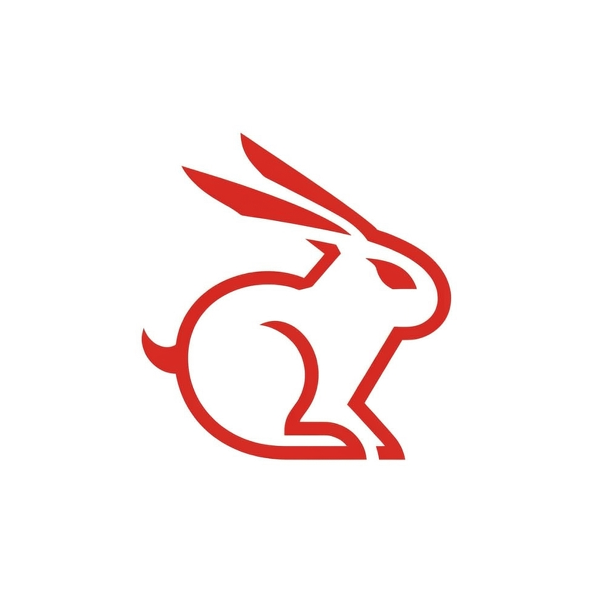
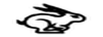
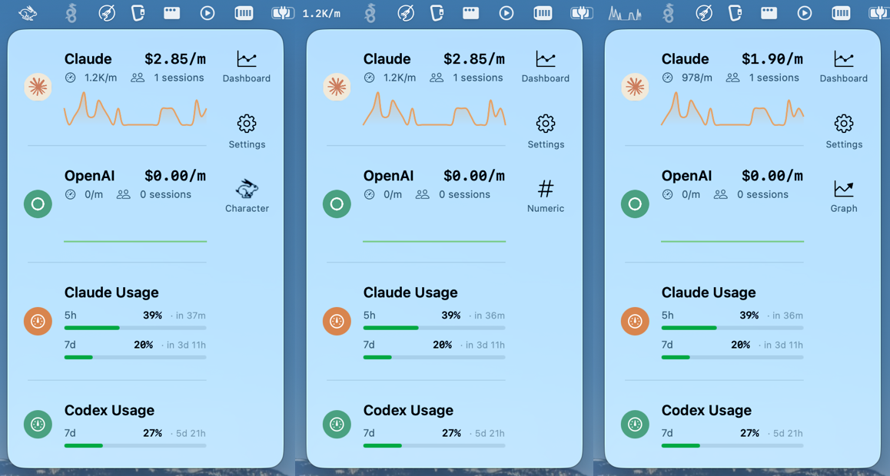
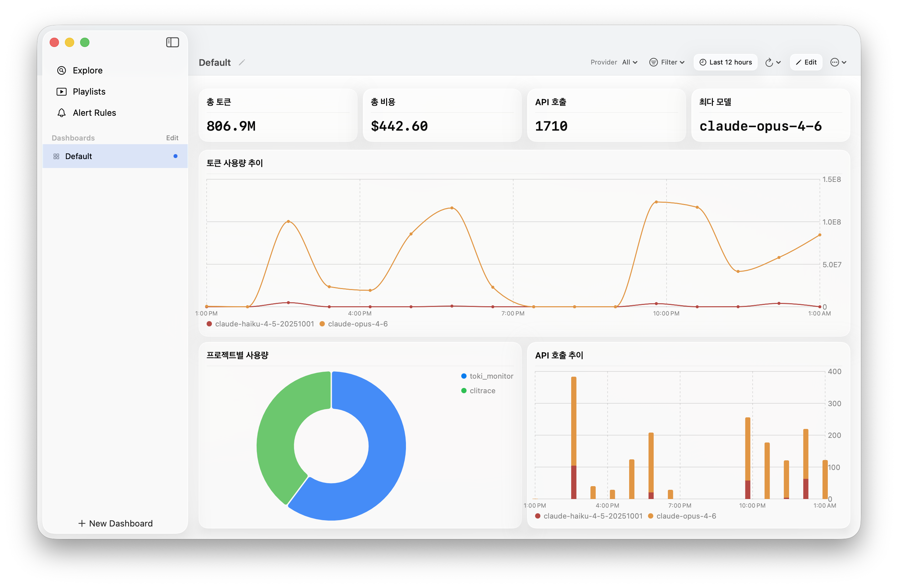
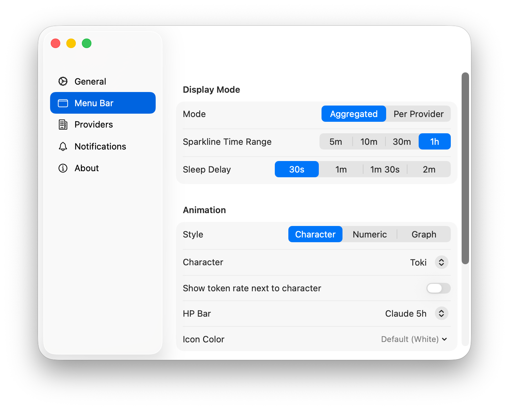
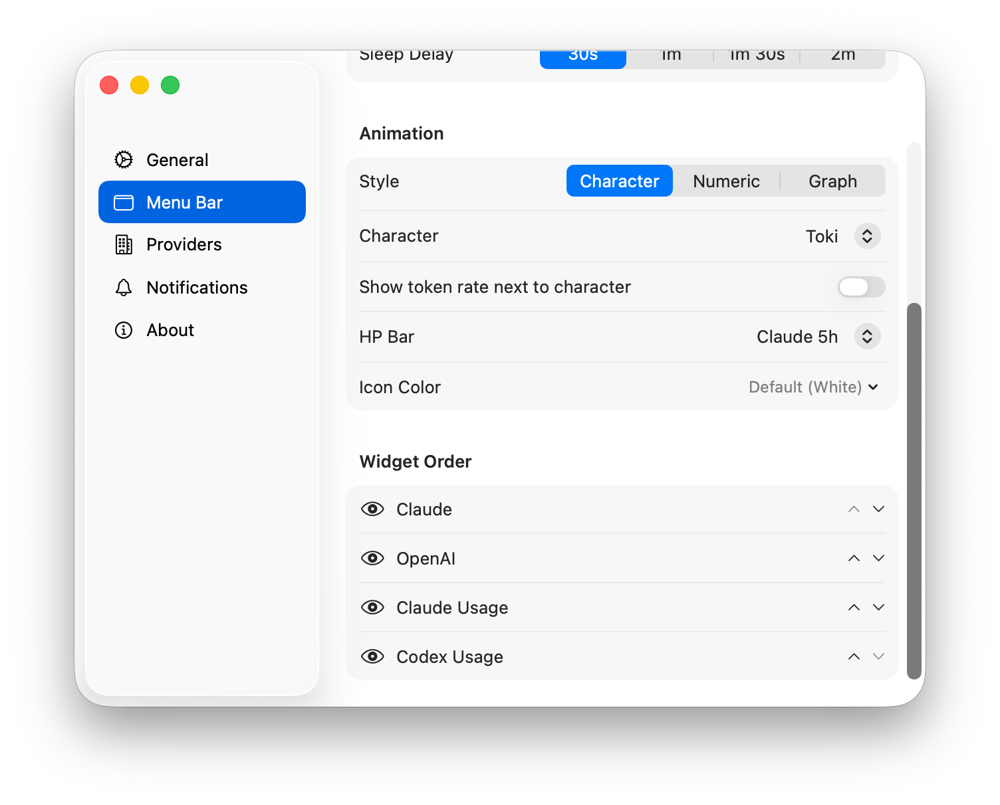
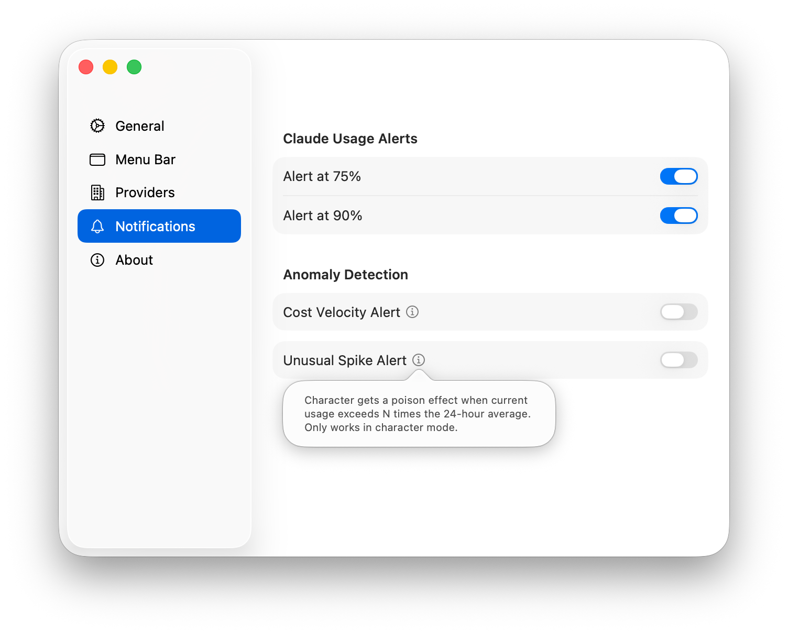

<p align="center">
  
</p>

<h1 align="center">Toki Monitor</h1>

<p align="center">
  <b>토큰을 태울수록 토끼가 빨라집니다.</b><br>
  Claude Code와 Codex CLI 토큰 사용량을 보여주는 macOS 메뉴바 모니터. <a href="https://github.com/korjwl1/toki">toki</a> (<i>tokki</i> = 토끼) 기반 — 이벤트 기반 수집, 인덱스 쿼리, 존재감 없이 항상 실행.
</p>

```bash
brew tap korjwl1/tap
brew install --cask toki-monitor
```

<p align="center">
  <a href="https://github.com/korjwl1/toki-monitor/releases/latest"></a>
  
  
  
  
</p>

<p align="center">
  <a href="README.md">🇺🇸 English</a> · <a href="#설치">설치</a> · <a href="#기능">기능</a> · <a href="#작동-원리">작동 원리</a> · <a href="#후원">후원</a>
</p>

<p align="center">
  
  &nbsp;&nbsp;&nbsp;
  
</p>

> [!IMPORTANT]
> 이 브랜치는 **0.2.4-dev**이며 Homebrew/GitHub에 공개된 v0.2.4가 아닙니다.
> 아래의 요금제 적합도, 히스토리 한도 윈도우 패널, 확장 대시보드 데이터
> 프레임, 모니터 설정 동기화는 이 체크아웃에 구현되어 있지만 아직 릴리즈되지
> 않은 대응 `toki` / `toki-sync` 소스 리비전이 필요합니다.

---

## 설치

```bash
brew tap korjwl1/tap
brew install --cask toki-monitor
```

공개된 Toki Monitor v0.2.4와 [toki](https://github.com/korjwl1/toki)가
자동으로 함께 설치됩니다. 앱을 실행하면 데몬을 자동으로 시작하고 관리합니다.
이 README에서 개발 버전이라고 표시한 기능은 아직 이 cask에 없습니다.

<details>
<summary>소스에서 빌드</summary>

```bash
git clone https://github.com/korjwl1/toki-monitor.git
cd toki-monitor
xcodebuild -project TokiMonitor.xcodeproj -scheme TokiMonitor -configuration Release build
```

macOS 14+ (Sonoma), Xcode 16+, Swift 6, `toki` 2.x CLI가 필요합니다. 이
체크아웃의 요금제 적합도와 히스토리 윈도우 화면은 `toki query windows`와
`WINDOWS` 데몬 명령을 구현한 대응 미릴리즈 `toki` 소스 리비전이 필요합니다.
바이너리가 Homebrew, Cargo, `~/.local/bin`의 표준 위치에 없으면
`TOKI_EXECUTABLE=/절대/경로/toki`를 지정하세요.
</details>

---

## 빠른 시작

```bash
# Homebrew로 설치했다면 바로 실행:
open /Applications/TokiMonitor.app

# Claude Code / Codex를 평소처럼 사용하세요 — 토큰 사용량이 즉시 반영됩니다.
# 토끼를 클릭하면 상세 정보, 우클릭하면 설정.
```

---

## 이런 분에게 추천합니다

- AI 비용을 한눈에. 토큰을 쓸 때 토끼가 달리고, 몇 분 유휴 시 잠듭니다 (zZ) — 아무 창도 열 필요 없이 소비 속도가 항상 보입니다.
- "총 토큰"보다 더 자세한 분석이 필요하다면? **대시보드**에서 커스텀 패널, PromQL 쿼리, 시계열 차트, 프로젝트별 파이 차트를 제공합니다. 모델, 기간, 프로바이더별 드릴다운 가능.
- Claude와 Codex를 같이 쓴다면? 둘 다 나란히 표시 — 사용량 바, 리밋 리셋, 비용. 합산/개별 표시를 한 번에 전환.
- 비용 폭주가 걱정된다면? $/분 임계값을 설정하세요. 너무 빠르게 쓰면 아이콘이 빨간색으로, 24시간 평균보다 급증하면 주황색으로 바뀝니다.

---

## 기능

### 메뉴바

| 모드 | 표시 내용 |
|------|----------|
| **캐릭터** | 토큰 속도에 비례해서 빨라지는 토끼. 대기 시 수면 (zZ). HP 바로 잔여 사용량 표시 가능. |
| **수치** | `1.2K/m` — 텍스트로 토큰 속도 표시 |
| **스파크라인** | 최근 히스토리 미니 그래프 |

캐릭터 모드는 시그모이드 속도 커브 (500–3,000 tok/m 구간이 가장 가파름). 프로바이더별로 모드 전환 가능. 우클릭으로 설정 / 종료.

<p align="center">
  
</p>

<p align="center">
  
  <br>
  <sub>일정 시간 사용이 없으면 토끼가 잠듭니다 (zZ).</sub>
</p>

### 대시보드

각 패널이 독립적으로 PromQL 쿼리를 실행합니다. 동일 쿼리는 자동 중복 제거.

- 시계열, 바 차트, 파이 차트, 스탯, 게이지, 테이블, 상태 타임라인
- 패널별 PromQL `{provider="..."}` 프로바이더 필터
- 프로젝트별 토큰 분석 (경로 자동 복원)
- 프리셋과 절대 시간 범위 선택
- 변수, 필드별 오버라이드, 값 매핑, 임계값, 변환, 패널 반복, 패널별 시간 범위
- 패널당 복수 쿼리, Panel Inspect, 지원하지 않는 쿼리의 명시적 오류 상태
- 백엔드 문법에 맞춘 PromQL 제안을 제공하는 Explore
- 대시보드 버전·어노테이션, JSON 가져오기/내보내기, 손실 방지 스키마 마이그레이션
- 열면 Dock에 표시, 닫으면 숨김

확장 프레임/필드/변환 파이프라인과 상태 타임라인은 미릴리즈
0.2.4-dev 체크아웃의 기능입니다.

<p align="center">
  
</p>

### 요금제 적합도 (0.2.4-dev, 미릴리즈)

대시보드 사이드바에서 여는 28일 분석 화면입니다. 완료된 프로바이더 한도
윈도우를 바탕으로 한도별 근거 기반 판정, 주간/월간 사용 추세, 소진 시점,
실사용 표본 커버리지, 모델 패턴, 프로바이더 및 구독 비교를 보여줍니다. 계정
유형, 커버리지, 표본 수가 충분하지 않으면 요금제 추천을 보류합니다. 로컬과
설정된 서버의 윈도우 히스토리는 프로바이더별로 합쳐지며, 서버에 없는
프로바이더의 풍부한 로컬 기록은 지우지 않습니다.

### 사용량 모니터링

| 프로바이더 | 표시 내용 |
|-----------|----------|
| **Claude** | 5시간, 주간, 제공되는 모델별 윈도우 + 리셋 카운트다운 |
| **Codex** | 5시간 및 주간 윈도우 + 리셋 카운트다운 |

현재 개발 빌드는 toki 데몬이 수집한 윈도우 상태를 우선 사용하고, 데몬이 이를
제공하지 못할 때 프로바이더의 로컬 인증 정보로 폴백합니다. 폴백 경로는
Claude의 macOS 키체인(`Claude Code-credentials`)과 Codex의
`~/.codex/auth.json`을 읽습니다. 색상 코드 바: 초록 → 노랑 → 주황 → 빨강.

로그인 안 됐으면? 위젯이 숨겨지는 대신 안내를 보여줍니다 — Claude는 "Claude Code 로그인 필요", Codex는 `codex --login` 명령어 표시.

### 이상 감지

- **비용 속도 경고** — $/분이 임계값 초과 시 캐릭터에 피격 이펙트 (별 버스트 + 흔들림)
- **이상 급증 경고** — 사용량이 24시간 평균의 N배 초과 시 캐릭터에 독 이펙트 (보라색 버블 + 색상 펄스)
- 캐릭터 모드에서만 동작
- 기본 꺼짐. 설정 → 알림에서 활성화.

<p align="center">
  
  <br>
  <sub>$/분이 임계값을 넘으면 별 버스트 + 흔들림 이펙트가 발생합니다.</sub>
</p>

### 설정

- 합산 또는 개별 프로바이더 표시 (독립 스타일 설정)
- 위젯 순서 변경 (위/아래 버튼 + 표시/숨김)
- HP 바 — 캐릭터 위 얇은 바로 Claude/Codex 잔여 사용량 표시 (초록 → 노랑 → 주황 → 빨강)
- 수면 대기 시간 (30초 / 1분 / 1분 30초 / 2분)
- Claude/Codex 윈도우별 사용량 알림 (75%, 90%)
- 정보 페이지: toki CLI 버전 표시, Homebrew 업데이트 확인
- 한국어 / 영어 완전 지역화
- macOS Tahoe에서 Liquid Glass 지원

### 동기화 (서버 모드)

[toki-sync](https://github.com/korjwl1/toki-sync) 서버에 연결하여 모든 디바이스의 사용량을 한 곳에서 볼 수 있습니다.

- 로컬 / 서버 전환 — 대시보드 툴바에서 로컬 데이터와 서버 집계 데이터를 전환
- 서버 모드는 toki-sync의 PromQL 프록시에 URLSession으로 직접 쿼리 (CLI 서브프로세스 오버헤드 없음)
- 디바이스 목록 — 등록된 모든 디바이스와 마지막 접속 시각 표시
- 토큰 갱신 — 401 시 JWT 자동 갱신, 재로그인 필요 시 시스템 알림
- HTTPS 필수 — HTTPS가 아닌 서버 URL은 거부 (localhost는 개발용으로 예외)

설정 → 동기화에서 구성합니다. 앱이 `toki settings sync enable`을 실행하며,
브라우저/device-code 로그인 후 공유 인증 정보와 동기화 설정을 기록합니다.
인증 정보는 macOS 키체인에 저장되고 toki 데몬과 공유됩니다.

0.2.4-dev 체크아웃에는 별도로 동의해야 하는 **모니터 설정 동기화** 채널도
있습니다. 대시보드 정의와 모니터 표시 설정을 15분마다 맞추며, 충돌은 이 Mac
유지 / 서버 버전 사용 / 둘 다 유지 중 사용자가 직접 결정합니다. 이 채널은
쿼리 결과·사용량·비용 수치를 보내지 않지만 대시보드 쿼리 문자열에 들어간
프로젝트명이나 모델명은 서버로 갈 수 있습니다. 데이터소스 정의와 로그인 항목
설정은 로컬에 남습니다. 대응 미릴리즈 toki-sync 서버와 monitor-settings API가
필요하며, 현재 태그된 `toki-sync-protocol` v1.0.0은 이 릴리즈 상태를 포함하지
않습니다.

<p align="center">
  
  
  
</p>

---

## 작동 원리

### 왜 toki인가?

다른 AI 사용량 모니터는 전부 같은 방식입니다: 타이머로 파일을 폴링하고, 전부 다시 파싱하고, 결과를 보여주고, 버립니다. 시간 범위를 바꾸면 다시 스캔, 앱을 닫으면 데이터 소실.

[toki](https://github.com/korjwl1/toki)는 다릅니다. Rust 데몬이 kqueue로 AI
도구 세션 파일을 감시해 전체 히스토리를 주기적으로 다시 읽지 않고 변경분을
이벤트 기반으로 수집합니다. 토큰은 내장 시계열 데이터베이스(fjall TSDB)에
저장되고, 인덱싱된 히스토리를 PromQL로 조회합니다. Toki Monitor 자체에는
속도 감쇠, 한도 상태, 동기화 상태, 업데이트 확인용 저빈도 타이머가 있으므로
“CPU 0%”를 앱 전체의 문자 그대로인 보장으로 표현하지 않습니다.

폴링/프록시 기반 모니터와의 전체 비교는 [docs/strengths.ko.md](docs/strengths.ko.md) 참조.

| | toki | 다른 모든 도구 |
|---|---|---|
| **수집 방식** | kqueue 파일 감시 — 이벤트 기반 증분 수집 | 타이머 기반 재스캔 (30초~5분 간격) |
| **저장** | 내장 TSDB — 영구 저장, 인덱싱 | 없음 — 앱 종료 시 소실 |
| **쿼리** | 인덱스 기반 PromQL 엔진 | 매번 전체 파일 재스캔 |
| **아키텍처** | 하나의 데몬이 CLI + 메뉴바 + 대시보드 지원 | 각 앱이 독립적으로 재스캔 |

### 아키텍처

```text
toki (Rust 데몬)                Toki Monitor (Swift/SwiftUI)
├─ fjall TSDB                   ├─ Data        // UDS, CLI, Keychain, ServerQueryClient
├─ kqueue 파일 감시             ├─ Domain      // 집계, 알림, SyncManager
├─ PromQL 엔진                  └─ Presentation// 메뉴바, 대시보드, 요금제 적합도, 설정
├─ UDS 서버
└─ sync 스레드 → toki-sync     toki-sync 서버 (선택)
                                ├─ PromQL/윈도우 쿼리 API
                                └─ monitor-settings API (0.2.4-dev 대응)

실시간: toki trace → 모니터 소유 UDS → 메뉴바
로컬:   패널 쿼리 → toki CLI → 데몬/TSDB → 프레임 → 패널
서버:   패널 쿼리 → URLSession → toki-sync → 프레임 → 패널
```

### 개인 정보

- 로컬 모드에는 텔레메트리가 없고 사용량 데이터가 이 Mac에 남습니다
- 사용량 API는 리밋 상태만 조회 — 프롬프트나 응답 내용에 접근하지 않음
- toki는 세션 파일을 읽기 전용으로 접근 — AI 도구 데이터를 수정하지 않음
- toki-sync를 켜면 사용량 데이터가 사용자가 지정한 서버로 업로드됩니다
- 모니터 설정 동기화를 별도로 켜면 대시보드 정의와 선택한 표시 설정이
  업로드되며, 동의 화면에서 정확한 범위를 안내합니다

---

## 지원 프로바이더

| 프로바이더 | CLI 도구 | Usage API | 상태 |
|-----------|---------|-----------|------|
| Anthropic | [Claude Code](https://claude.ai/code) | OAuth | 출시 |
| OpenAI | [Codex CLI](https://github.com/openai/codex) | OAuth | 출시 |
| Google | [Gemini CLI](https://github.com/google-gemini/gemini-cli) | — | 예정 |

일반 쿼리/대시보드 경로는 toki의 프로바이더 태그 스키마를 따릅니다. 새
프로바이더에는 `ProviderRegistry` 메타데이터가 필요하며, 프로바이더별 한도
위젯은 API가 다르면 별도의 인증/사용량 어댑터도 필요합니다.

---

## 테스트

```bash
xcodebuild test -project TokiMonitor.xcodeproj -scheme TokiMonitor -destination 'platform=macOS'
```

현재 소스에는 **Swift Testing 테스트 943개와 XCTest 메서드 18개**가 있습니다.
IPC/CLI 경계, 대시보드 저장·마이그레이션, 프레임·쿼리 의미론, 윈도우 및
요금제 적합도 통계, 설정 동기화 충돌, 접근성, 대비, 렌더 스냅샷을 검증합니다.
프로덕션 clock을 주입할 수 없어 전체 스위트에서 불안정한 `TokenAggregator`
타이머 테스트 3개는 의도적으로 비활성화되어 있으며, 통과한 커버리지로 세지
않는 known skip입니다.

---

## 기여

설치, 빌드 명령, PR 가이드라인은 [CONTRIBUTING.md](CONTRIBUTING.md) 참조.

빠른 경로:

1. Fork → feature branch → `main`에 PR
2. 버그 리포트: macOS 버전, `toki --version`, 재현 방법 포함

---

## 커스텀 애니메이션

소스 기여자는 앱에 번들되는 캐릭터를 추가할 수 있습니다.
`TokiMonitor/Resources/Animations/` 아래에 폴더를 만드세요:

```text
Resources/Animations/
  rabbit/              ← 기본 내장
    theme.json
    run_00.png
    ...
  my-character/        ← 직접 추가
    theme.json
    run_00.png ~ run_XX.png
    sleep_00.png ~ sleep_XX.png   (선택)
```

### 프레임 사양

- **크기**: 28×18 px (또는 `theme.json`에서 지정한 크기)
- **포맷**: 투명 배경 PNG, 검정(`#000000`)만 사용
- **템플릿**: macOS 템플릿 이미지로 렌더링 (시스템이 자동 틴팅)
- **이름**: `run_00.png`, `run_01.png`, ... (순번, 0-패딩)
- **프레임 수**: 자유 — 자동 감지

### theme.json

```json
{
  "id": "my-character",
  "name": "English Name",
  "nameKo": "한국어 이름",
  "frameSize": [28, 18],
  "canvasSize": [28, 18],
  "hpBar": {
    "widthRatio": 0.7,
    "height": 2,
    "yOffset": 1,
    "xOffset": 0
  },
  "sleep": {
    "mode": "overlay",
    "textOffset": [-7, -1],
    "fontSize": 5,
    "interval": 0.8
  }
}
```

| 필드 | 설명 |
|------|------|
| `frameSize` | 캐릭터 그리기 크기 (pt 단위, [너비, 높이]) |
| `canvasSize` | 마진 포함 전체 캔버스 크기 |
| `hpBar.widthRatio` | 캐릭터 너비 대비 바 너비 비율 (0.0–1.0) |
| `hpBar.height` | 바 높이 (pt) |
| `hpBar.yOffset` | 상단에서의 거리 (pt) |
| `hpBar.xOffset` | 중앙에서의 좌우 보정 (pt) |
| `sleep.mode` | `"overlay"` = zZ 텍스트 자동 생성, `"frames"` = `sleep_XX.png` 파일 사용 |
| `sleep.textOffset` | zZ 텍스트 위치 오프셋 (캐릭터 우상단 기준, overlay 모드) |
| `sleep.interval` | 수면 애니메이션 프레임당 초 |

앱에 번들된 테마는 시작 시 자동 탐색됩니다. 설정 → 메뉴바 → 캐릭터에서
선택하세요. 현재 사용자 홈 디렉터리의 별도 테마 폴더는 지원하지 않습니다.

---

## 예정된 기능

- Gemini CLI 지원 — Google Gemini 프로바이더 연동
- 사용량 보고서 — 주간/월간 요약, 전주 대비 및 전월 대비 분석
- 0.2.4-dev의 윈도우/요금제 적합도/대시보드/설정 동기화 작업을 대응 toki,
  toki-sync, protocol 태그와 함께 릴리즈

---

## 후원

<a href="https://github.com/sponsors/korjwl1">
  
</a>

Toki Monitor가 유용하다면 후원을 통해 개발을 지원해주세요.

유료 제품에서의 상업적 사용은 후원 또는 [문의](mailto:korjwl1@gmail.com)를 부탁드립니다.

---

## 라이선스

[MIT](LICENSE) — [@korjwl1](https://github.com/korjwl1)

[toki](https://github.com/korjwl1/toki) 생태계의 일부입니다.
