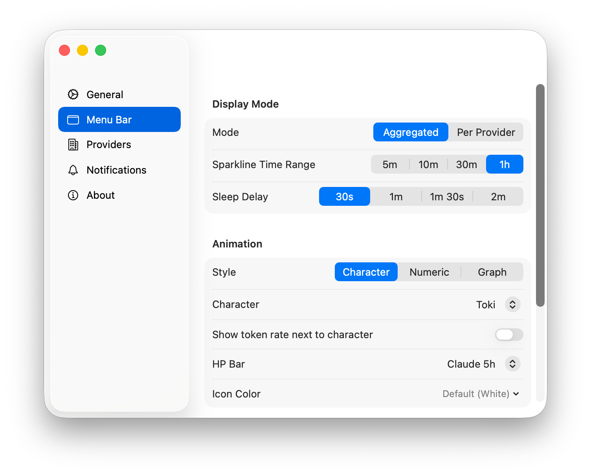
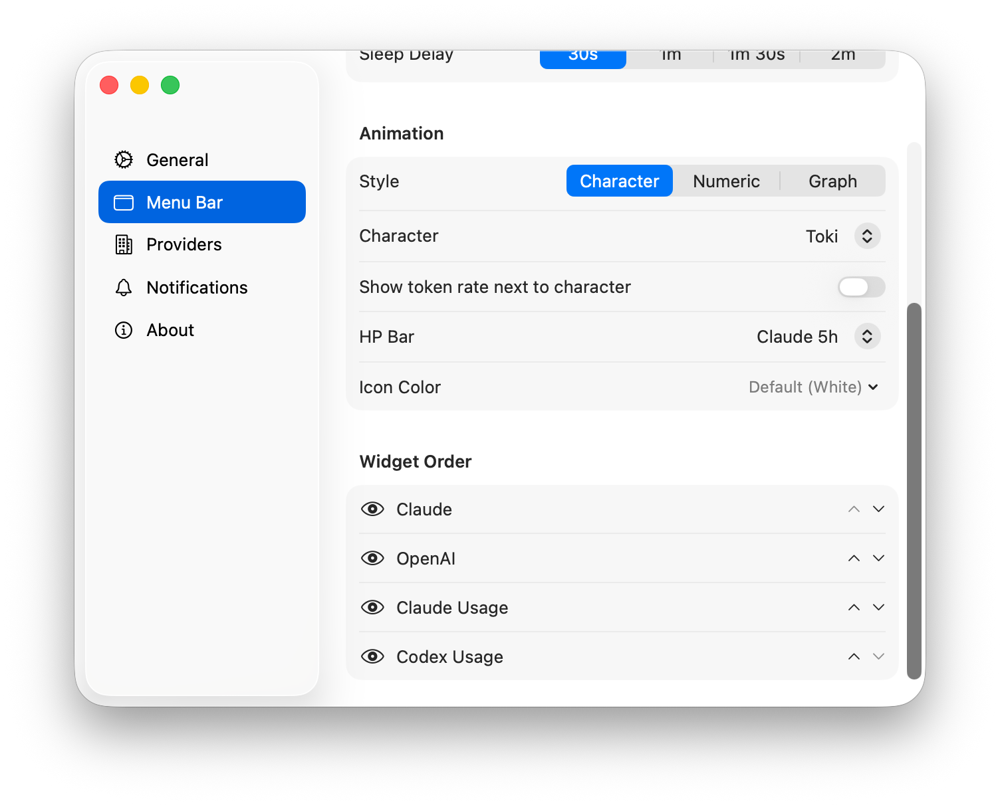
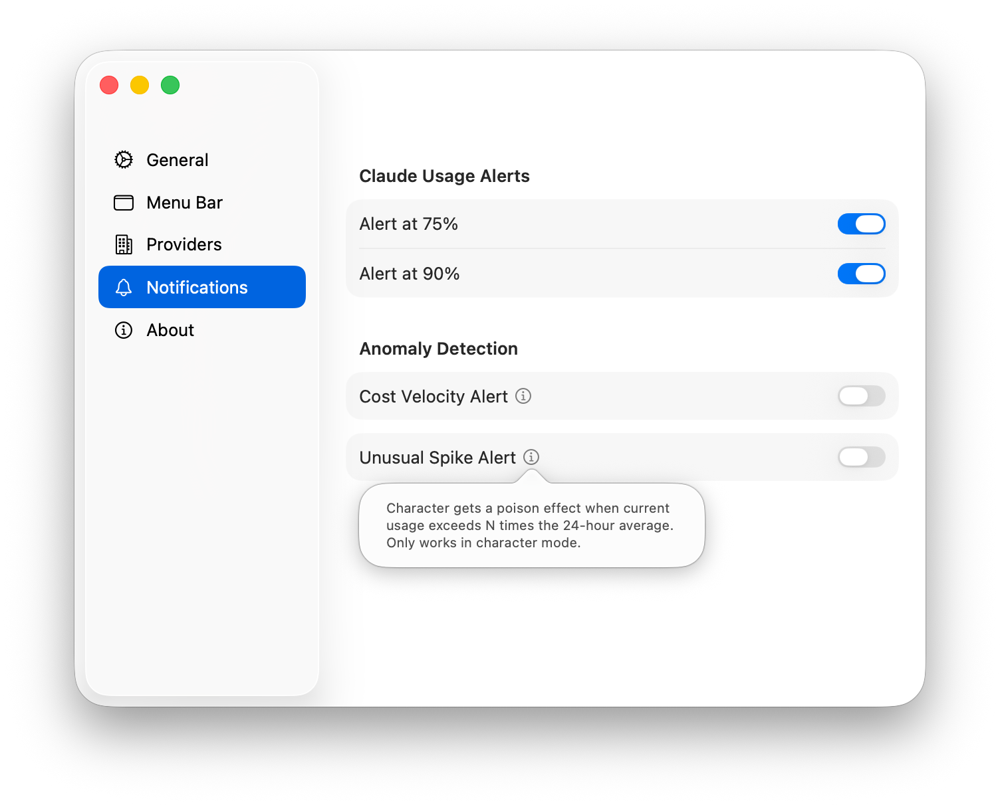

<p align="center">
  
</p>

<h1 align="center">Toki Monitor</h1>

<p align="center">
  <b>A rabbit that runs as fast as you burn tokens.</b><br>
  macOS menu bar AI token monitor. Powered by <a href="https://github.com/korjwl1/toki">toki</a> — zero CPU at idle, instant queries, always running in the background without you noticing.
</p>

<p align="center">
  <a href="https://github.com/korjwl1/toki-monitor/releases/latest"></a>
  
  
  
  
</p>

<p align="center">
  <a href="README.ko.md">🇰🇷 한국어</a> · <a href="#install">Install</a> · <a href="#features">Features</a> · <a href="#how-it-works">How it works</a> · <a href="#sponsor">Sponsor</a>
</p>

<p align="center">
  
</p>

<p align="center">
  
  &nbsp;&nbsp;&nbsp;
  
</p>

> Powered by [**toki**](https://github.com/korjwl1/toki) (**to**ken **i**nspector, *tokki* = 토끼) — a fast, lightweight Rust daemon for tracking AI token usage.

---

## Install

```bash
brew tap korjwl1/tap
brew install --cask toki-monitor
```

This installs [toki](https://github.com/korjwl1/toki) automatically. Launch the app — the daemon starts on its own.

<details>
<summary>Build from source</summary>

```bash
git clone https://github.com/korjwl1/toki-monitor.git
cd toki-monitor
xcodebuild build -scheme TokiMonitor -configuration Release
```

Requires macOS 14+ (Sonoma), Xcode 15.2+, and [toki](https://github.com/korjwl1/toki) CLI.
</details>

---

## Quick Start

```bash
# If you installed via Homebrew, just launch:
open /Applications/TokiMonitor.app

# Use Claude Code / Codex as usual — token usage appears instantly.
# Click the rabbit for details. Right-click for settings.
```

The app auto-starts the toki daemon if it's not running. On first launch, provider settings are synced from toki automatically.

---

## Who is this for?

- **Want to see your AI spend at a glance?** The rabbit runs when you're using tokens. Idle for a few minutes? It falls asleep (zZ). No need to open anything — your spend rate is always visible.

- **Need more than "total tokens"?** Open the dashboard — customizable panels, PromQL queries, time-series charts, pie charts by project. Drill down by model, time range, or provider.

- **Using Claude AND Codex?** See both side-by-side — usage bars, rate limits, costs. One click to toggle aggregated vs. per-provider.

- **Worried about runaway costs?** Set a $/min threshold. The icon turns red when you're spending too fast, or orange when usage spikes above your 24-hour average.

---

## Features

### Menu bar

| Mode | What you see |
|------|-------------|
| **Character** | Rabbit that runs faster as token rate increases. Sigmoid speed curve — steep in the 500–3,000 tok/m range. Sleeps (zZ) when idle. Optional HP bar shows remaining usage. |
| **Numeric** | `1.2K/m` — token rate as text (per minute / per second / raw) |
| **Sparkline** | Mini graph of recent history (configurable: 5m / 10m / 30m / 1h) |

Switch modes per provider. Right-click for Settings / Quit.

<p align="center">
  
</p>

### Dashboard

Each panel runs its own PromQL query. Identical queries are deduplicated automatically.

- Time series, bar chart, **pie chart**, stat, gauge, table
- Provider filter via PromQL `{provider="..."}` — applied per panel
- Project-level token breakdown with smart path recovery
- Time range picker with presets and absolute dates
- Dashboard versioning and annotations
- Shows in Dock when open, hides when closed

<p align="center">
  
</p>

### Usage monitoring

| Provider | What you get |
|----------|-------------|
| **Claude** | 5-hour and 7-day windows with reset countdown |
| **Codex** | Weekly and 5-hour windows with reset countdown |

Reads credentials directly from each CLI's local storage — no extra login required. Claude reads from the macOS Keychain (`Claude Code-credentials`), Codex from `~/.codex/auth.json`. Color-coded bars: green → yellow → orange → red.

Not logged in? The widget shows a prompt instead of hiding — Claude shows "Claude Code login required", Codex shows the `codex --login` command.

### Anomaly detection

- **Velocity alert** — icon color changes when $/min exceeds your threshold
- **Historical baseline** — compares against your 24-hour average via PromQL
- Choose: icon color change, system notification, or both
- Custom alert colors per type
- Off by default. Configure in Settings → Notifications.

### Settings

- Aggregated or per-provider display with independent style overrides
- Widget order (up/down buttons + show/hide per provider)
- HP bar — thin bar above character showing remaining Claude/Codex usage (green → yellow → orange → red)
- Sleep delay (30s / 1m / 1m 30s / 2m)
- Usage alerts (Claude 75%, 90%)
- About page with toki CLI version and Homebrew update check
- Full Korean / English localization
- Liquid Glass on macOS Tahoe

<p align="center">
  
  
  
</p>

---

## How it works

### Why toki?

Every other AI usage monitor works the same way: poll files on a timer, reparse everything, show the result, throw it away. Switch to a different time range? Rescan. Close the app? Data gone.

[**toki**](https://github.com/korjwl1/toki) is different. It's a Rust daemon that watches your AI tool session files via kqueue — event-driven, not polling. When tokens flow, toki captures them instantly into an embedded time-series database (fjall TSDB). When nothing happens, CPU usage is literally 0%.

The result: your entire token history is indexed and queryable at any time range in ~7ms via PromQL — no rescanning, no waiting, no lag. And it all runs in ~5MB of memory, lighter than most menu bar icons.

| | toki | Every other tool |
|---|---|---|
| **How it collects** | kqueue file watcher — instant, 0% CPU idle | Timer-based rescan (30s–5min intervals) |
| **Where it stores** | Embedded TSDB — persistent, indexed | Nowhere — lost when app closes |
| **How it queries** | PromQL engine — ~7ms any range | Full file rescan each time |
| **Memory** | ~5 MB | 20–100 MB+ |
| **Architecture** | One daemon serves CLI + menu bar + dashboard | Each app rescans independently |

toki runs silently in the background — you won't notice it until you need it. No setup, no config files, no database to manage. It just works.

### Architecture

```
toki (Rust daemon)              Toki Monitor (Swift/SwiftUI)
├─ fjall TSDB                   ├─ Data        // UDS, CLI, Keychain
├─ kqueue file watchers         ├─ Domain      // Aggregation, alerts
├─ PromQL engine                └─ Presentation// Menu bar, dashboard
└─ UDS server

Real-time:  daemon → trace → UDS → EventStream → Aggregator → Menu Bar
Dashboard:  Panel query → interpolate($__from, $provider) → toki report → Chart
Usage:      Claude Keychain / Codex auth.json → Monitor → Widget
```

### Privacy

- All data stays on your machine — no telemetry, no cloud
- Usage APIs read only rate limit status, never prompts or responses
- toki reads session files read-only — never modifies your AI tool data

---

## Supported Providers

| Provider | CLI Tool | Usage API | Status |
|----------|---------|-----------|--------|
| Anthropic | [Claude Code](https://claude.ai/code) | OAuth | ✅ |
| OpenAI | [Codex CLI](https://github.com/openai/codex) | OAuth | ✅ |
| Google | [Gemini CLI](https://github.com/google-gemini/gemini-cli) | — | ⏳ Planned |

Adding a provider only requires a toki parser — Toki Monitor picks it up automatically.

---

## Testing

```bash
xcodebuild test -scheme TokiMonitor -destination 'platform=macOS'
```

36 tests, 8 suites: event parsing, report decoding, state transitions, animation mapping, formatting, provider registry, data aggregation.

---

## Contributing

Contributions welcome!

1. Fork → feature branch → PR against `main`
2. For bugs: include macOS version, `toki --version`, steps to reproduce

---

## Custom Animations

Add your own character to the menu bar. Each theme is a folder under `Resources/Animations/`:

```
Resources/Animations/
  rabbit/              ← built-in default
    theme.json
    run_00.png
    run_01.png
    ...
  your-character/      ← add your own
    theme.json
    run_00.png ~ run_XX.png
    sleep_00.png ~ sleep_XX.png   (optional)
```

### Frame specs

- **Size**: 28×18 px (or any size — set in `theme.json`)
- **Format**: transparent background PNG, black only (`#000000`)
- **Template**: frames are rendered as macOS template images (system tints automatically)
- **Naming**: `run_00.png`, `run_01.png`, ... (sequential, zero-padded)
- **Count**: any number of frames — detected automatically

### theme.json

```json
{
  "id": "your-character",
  "name": "Display Name",
  "nameKo": "한국어 이름",
  "frameSize": [28, 18],
  "canvasSize": [28, 18],
  "hpBar": {
    "widthRatio": 0.7,
    "height": 2,
    "yOffset": 1,
    "xOffset": 0
  },
  "sleep": {
    "mode": "overlay",
    "textOffset": [-7, -1],
    "fontSize": 5,
    "interval": 0.8
  }
}
```

| Field | Description |
|-------|-------------|
| `frameSize` | Character draw size in pt (width, height) |
| `canvasSize` | Total canvas size including margins |
| `hpBar.widthRatio` | Bar width as ratio of character width (0.0–1.0) |
| `hpBar.height` | Bar height in pt |
| `hpBar.yOffset` | Distance from top in pt |
| `hpBar.xOffset` | Horizontal offset from center in pt |
| `sleep.mode` | `"overlay"` = auto-generate zZ text, `"frames"` = use `sleep_XX.png` files |
| `sleep.textOffset` | zZ position offset from top-right of character (overlay mode) |
| `sleep.interval` | Seconds per frame during sleep animation |

Themes are discovered at launch. Select in Settings → Menu Bar → Character.

---

## Upcoming

- **Gemini CLI support** — Google Gemini provider integration
- **Multi-device sync** — share usage data across machines via toki-sync
- **Usage reports** — weekly/monthly summaries with week-over-week and month-over-month comparisons

---

## Sponsor

<a href="https://github.com/sponsors/korjwl1">
  
</a>

If Toki Monitor is useful to you, consider sponsoring to support development.

For commercial use in paid products, please sponsor or [reach out](mailto:korjwl1@gmail.com).

---

## License

[FSL-1.1-Apache-2.0](LICENSE) — built by [@korjwl1](https://github.com/korjwl1)

Part of the [toki](https://github.com/korjwl1/toki) ecosystem.
